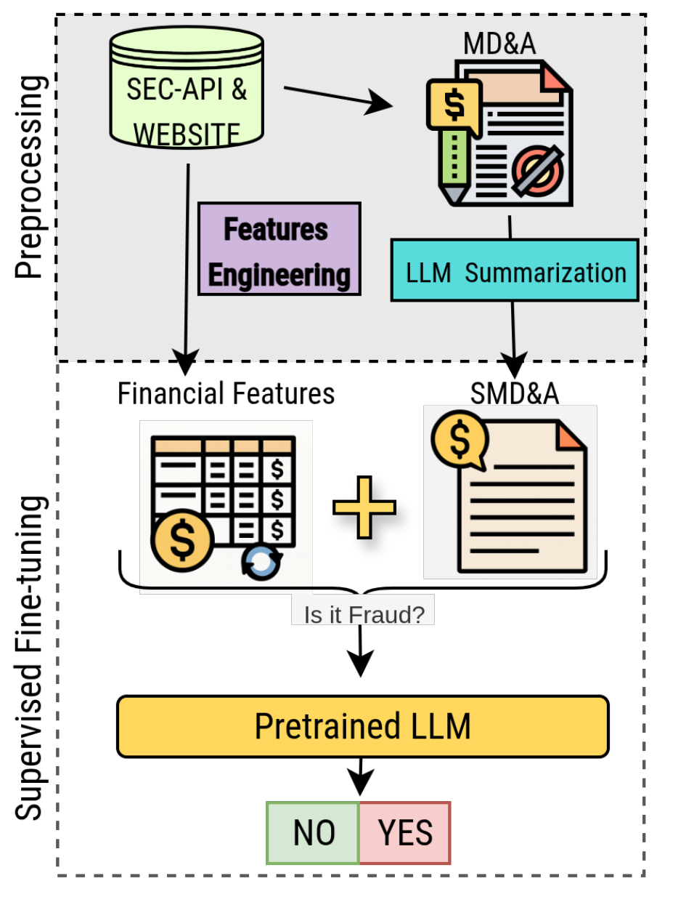

# FINANCIAL STATEMENT FRAUD DETECTION

This Repository contains the official code of the paper [Read Between the Lines: A Robust Financial Statement Fraud Detection
Framework](https://hal.science/file/index/docid/5375997/filename/anoymous-submission-with-appendices.pdf)




# 1. Dataset 
The Preprocessed dataset is freely downloadable from https://huggingface.co/datasets/WaguyMZ/Financial_statements_fraud_dataset/tree/main.


The preprocessed dataset includes : 
- 17 863 Summarized quarterly MD&A reports using a self-hosted QWEN3 32B Model.
- 3 300 AAER reports
- 269 097 Quarterly Financial reports
- Final ready-to-use preprocessed datasets with distinct splitting strategies : 
    *   Random Splitting  
    *   Company-isolated splitting  : Our paper demonstrates that the company-isolated setting is a more rigourous framework for the financial statement fraud detection task.
    *   Time splitting. 

Each dataset comprises 5 folds and each folds comes with its *train.csv* and *test.csv*


# 1.1. Downloading the dataset

#### On Linux

```
cd researchpkg/anomaly_detection
/bin/bash scripts/download_preprocessed_data.sh
```

#### On Windows

```
cd researchpkg\anomaly_detection
scripts/download_preprocessed_data_win.bat
```

# 1.2. Obtaining the Entire Raw dataset

If you need the entire raw dataset, please contact us at guywaffo@gmail.com


# 2. Training 

## Namings convention :
- v4 : Dataset with company-isolated splitting
- v5 : Dataset with random  splitting
- v6 : Dataset with time splitting


All the train script are available in the the drirectory researchpkg/anomaly_detection/scripts

To reproduce our paper's results, we recommend to use one Nvidia H100 GPU with 95GB VRAM. If you have a GPU with less memory, you might adjust he batch size to avoid OOM error. 

## 2.1.  Reproduce all  Llama 8B Results:

```
cd researchpkg/anomaly_detection
/bin/bash scripts/train/run_all_llama8b.sh
```
This script should take a lot of time(48h) due to number of folds and the different configurations (Financial Only, Financial+Text, Text Only). Feel free to adapt the script if you want to evaluate a specific configuration. 

## 2.2. Reproducing all Fino 8B Results

```
cd researchpkg/anomaly_detection
/bin/bash scripts/train/run_all_fino8b.sh
```


## 2.3. Other models. 
Other *run_XXX scripts* are provided to run the other approaches mentionned in our paper: LightGBM, RandomForest, LogisticRegression, RCMA